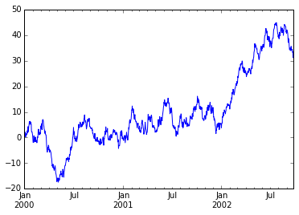
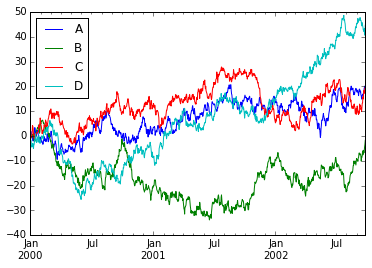

## 载入所需要的包

    %matplotlib inline
    import pandas as pd
    import numpy as np
    import matplotlib.pyplot as plt

## 创建对象

### 通过传递一个list对象来创建一个Series，pandas会默认创建整型索引：

    s = pd.Series([1,3,5,np.nan,6,8])
    s

    0     1
    1     3
    2     5
    3   NaN
    4     6
    5     8
    dtype: float64

### 通过传递一个numpy array，时间索引以及列标签来创建一个DataFrame：

    dates = pd.date_range('20130101', periods=6)
    dates

    DatetimeIndex(['2013-01-01', '2013-01-02', '2013-01-03', '2013-01-04',
                   '2013-01-05', '2013-01-06'],
                  dtype='datetime64[ns]', freq='D', tz=None)

    df = pd.DataFrame(np.random.randn(6,4), index=dates, columns=list('ABCD'))
    df

<table border="1" class="dataframe">
  <thead>
    <tr style="text-align: right;">
      <th></th>
      <th>A</th>
      <th>B</th>
      <th>C</th>
      <th>D</th>
    </tr>
  </thead>
  <tbody>
    <tr>
      <th>2013-01-01</th>
      <td>0.711575</td>
      <td>-1.211553</td>
      <td>0.358554</td>
      <td>-0.237294</td>
    </tr>
    <tr>
      <th>2013-01-02</th>
      <td>-0.310642</td>
      <td>-0.506779</td>
      <td>0.410359</td>
      <td>-0.231321</td>
    </tr>
    <tr>
      <th>2013-01-03</th>
      <td>-0.755484</td>
      <td>1.134460</td>
      <td>-1.193612</td>
      <td>-0.640970</td>
    </tr>
    <tr>
      <th>2013-01-04</th>
      <td>0.872085</td>
      <td>-0.953514</td>
      <td>0.338744</td>
      <td>-0.005520</td>
    </tr>
    <tr>
      <th>2013-01-05</th>
      <td>-0.219312</td>
      <td>-1.251797</td>
      <td>0.891250</td>
      <td>0.249234</td>
    </tr>
    <tr>
      <th>2013-01-06</th>
      <td>1.372908</td>
      <td>0.300261</td>
      <td>2.096987</td>
      <td>-0.433615</td>
    </tr>
  </tbody>
</table>

### 通过传递一个能够被转换成类似序列结构的字典对象来创建一个DataFrame：

    df2 = pd.DataFrame({ 'A' : 1.,
                        'B' : pd.Timestamp('20130102'), 
                        'C' : pd.Series(1,index=list(range(4)),dtype='float32'),
                        'D' : np.array([3] * 4,dtype='int32'),
                        'E' : pd.Categorical(["test","train","test","train"]),
                        'F' : 'foo' })
    df2

<table border="1" class="dataframe">
  <thead>
    <tr style="text-align: right;">
      <th></th>
      <th>A</th>
      <th>B</th>
      <th>C</th>
      <th>D</th>
      <th>E</th>
      <th>F</th>
    </tr>
  </thead>
  <tbody>
    <tr>
      <th>0</th>
      <td>1</td>
      <td>2013-01-02</td>
      <td>1</td>
      <td>3</td>
      <td>test</td>
      <td>foo</td>
    </tr>
    <tr>
      <th>1</th>
      <td>1</td>
      <td>2013-01-02</td>
      <td>1</td>
      <td>3</td>
      <td>train</td>
      <td>foo</td>
    </tr>
    <tr>
      <th>2</th>
      <td>1</td>
      <td>2013-01-02</td>
      <td>1</td>
      <td>3</td>
      <td>test</td>
      <td>foo</td>
    </tr>
    <tr>
      <th>3</th>
      <td>1</td>
      <td>2013-01-02</td>
      <td>1</td>
      <td>3</td>
      <td>train</td>
      <td>foo</td>
    </tr>
  </tbody>
</table>

### 查看不同列的数据类型：

    df2.dtypes

    A           float64
    B    datetime64[ns]
    C           float32
    D             int32
    E          category
    F            object
    dtype: object

### 如果你使用的是IPython，使用Tab自动补全功能会自动识别所有的属性以及自定义的列，下图中是所有能够被自动识别的属性的一个子集：

    #df2.<TAB>

## 查看数据

### 查看frame中头部的行：

    df.head()

<table border="1" class="dataframe">
  <thead>
    <tr style="text-align: right;">
      <th></th>
      <th>A</th>
      <th>B</th>
      <th>C</th>
      <th>D</th>
    </tr>
  </thead>
  <tbody>
    <tr>
      <th>2013-01-01</th>
      <td>0.711575</td>
      <td>-1.211553</td>
      <td>0.358554</td>
      <td>-0.237294</td>
    </tr>
    <tr>
      <th>2013-01-02</th>
      <td>-0.310642</td>
      <td>-0.506779</td>
      <td>0.410359</td>
      <td>-0.231321</td>
    </tr>
    <tr>
      <th>2013-01-03</th>
      <td>-0.755484</td>
      <td>1.134460</td>
      <td>-1.193612</td>
      <td>-0.640970</td>
    </tr>
    <tr>
      <th>2013-01-04</th>
      <td>0.872085</td>
      <td>-0.953514</td>
      <td>0.338744</td>
      <td>-0.005520</td>
    </tr>
    <tr>
      <th>2013-01-05</th>
      <td>-0.219312</td>
      <td>-1.251797</td>
      <td>0.891250</td>
      <td>0.249234</td>
    </tr>
  </tbody>
</table>

### 查看frame中尾部的行：

    df.tail(3)

<table border="1" class="dataframe">
  <thead>
    <tr style="text-align: right;">
      <th></th>
      <th>A</th>
      <th>B</th>
      <th>C</th>
      <th>D</th>
    </tr>
  </thead>
  <tbody>
    <tr>
      <th>2013-01-04</th>
      <td>0.872085</td>
      <td>-0.953514</td>
      <td>0.338744</td>
      <td>-0.005520</td>
    </tr>
    <tr>
      <th>2013-01-05</th>
      <td>-0.219312</td>
      <td>-1.251797</td>
      <td>0.891250</td>
      <td>0.249234</td>
    </tr>
    <tr>
      <th>2013-01-06</th>
      <td>1.372908</td>
      <td>0.300261</td>
      <td>2.096987</td>
      <td>-0.433615</td>
    </tr>
  </tbody>
</table>

###  显示索引、列和底层的numpy数据：

    df.index

    DatetimeIndex(['2013-01-01', '2013-01-02', '2013-01-03', '2013-01-04',
                   '2013-01-05', '2013-01-06'],
                  dtype='datetime64[ns]', freq='D', tz=None)

    df.columns

    Index(['A', 'B', 'C', 'D'], dtype='object')

    df.values

    array([[ 0.71157486, -1.21155342,  0.35855422, -0.23729442],
           [-0.31064162, -0.50677856,  0.41035943, -0.231321  ],
           [-0.75548411,  1.1344604 , -1.19361207, -0.64096992],
           [ 0.87208491, -0.95351351,  0.33874365, -0.00551953],
           [-0.21931227, -1.25179667,  0.89124956,  0.24923414],
           [ 1.37290816,  0.30026146,  2.09698698, -0.4336146 ]])

### describe()函数对于数据的快速统计汇总：

    df.describe

    <bound method DataFrame.describe of                    A         B         C         D
    2013-01-01  0.711575 -1.211553  0.358554 -0.237294
    2013-01-02 -0.310642 -0.506779  0.410359 -0.231321
    2013-01-03 -0.755484  1.134460 -1.193612 -0.640970
    2013-01-04  0.872085 -0.953514  0.338744 -0.005520
    2013-01-05 -0.219312 -1.251797  0.891250  0.249234
    2013-01-06  1.372908  0.300261  2.096987 -0.433615>

### 对数据的转置：

    df.T

<table border="1" class="dataframe">
  <thead>
    <tr style="text-align: right;">
      <th></th>
      <th>2013-01-01 00:00:00</th>
      <th>2013-01-02 00:00:00</th>
      <th>2013-01-03 00:00:00</th>
      <th>2013-01-04 00:00:00</th>
      <th>2013-01-05 00:00:00</th>
      <th>2013-01-06 00:00:00</th>
    </tr>
  </thead>
  <tbody>
    <tr>
      <th>A</th>
      <td>0.711575</td>
      <td>-0.310642</td>
      <td>-0.755484</td>
      <td>0.872085</td>
      <td>-0.219312</td>
      <td>1.372908</td>
    </tr>
    <tr>
      <th>B</th>
      <td>-1.211553</td>
      <td>-0.506779</td>
      <td>1.134460</td>
      <td>-0.953514</td>
      <td>-1.251797</td>
      <td>0.300261</td>
    </tr>
    <tr>
      <th>C</th>
      <td>0.358554</td>
      <td>0.410359</td>
      <td>-1.193612</td>
      <td>0.338744</td>
      <td>0.891250</td>
      <td>2.096987</td>
    </tr>
    <tr>
      <th>D</th>
      <td>-0.237294</td>
      <td>-0.231321</td>
      <td>-0.640970</td>
      <td>-0.005520</td>
      <td>0.249234</td>
      <td>-0.433615</td>
    </tr>
  </tbody>
</table>

### 按轴进行排序:

    df.sort_index(axis=1,ascending=True)

<table border="1" class="dataframe">
  <thead>
    <tr style="text-align: right;">
      <th></th>
      <th>A</th>
      <th>B</th>
      <th>C</th>
      <th>D</th>
    </tr>
  </thead>
  <tbody>
    <tr>
      <th>2013-01-01</th>
      <td>0.711575</td>
      <td>-1.211553</td>
      <td>0.358554</td>
      <td>-0.237294</td>
    </tr>
    <tr>
      <th>2013-01-02</th>
      <td>-0.310642</td>
      <td>-0.506779</td>
      <td>0.410359</td>
      <td>-0.231321</td>
    </tr>
    <tr>
      <th>2013-01-03</th>
      <td>-0.755484</td>
      <td>1.134460</td>
      <td>-1.193612</td>
      <td>-0.640970</td>
    </tr>
    <tr>
      <th>2013-01-04</th>
      <td>0.872085</td>
      <td>-0.953514</td>
      <td>0.338744</td>
      <td>-0.005520</td>
    </tr>
    <tr>
      <th>2013-01-05</th>
      <td>-0.219312</td>
      <td>-1.251797</td>
      <td>0.891250</td>
      <td>0.249234</td>
    </tr>
    <tr>
      <th>2013-01-06</th>
      <td>1.372908</td>
      <td>0.300261</td>
      <td>2.096987</td>
      <td>-0.433615</td>
    </tr>
  </tbody>
</table>

    df.sort_index(axis=1,ascending=False)

<table border="1" class="dataframe">
  <thead>
    <tr style="text-align: right;">
      <th></th>
      <th>D</th>
      <th>C</th>
      <th>B</th>
      <th>A</th>
    </tr>
  </thead>
  <tbody>
    <tr>
      <th>2013-01-01</th>
      <td>-0.237294</td>
      <td>0.358554</td>
      <td>-1.211553</td>
      <td>0.711575</td>
    </tr>
    <tr>
      <th>2013-01-02</th>
      <td>-0.231321</td>
      <td>0.410359</td>
      <td>-0.506779</td>
      <td>-0.310642</td>
    </tr>
    <tr>
      <th>2013-01-03</th>
      <td>-0.640970</td>
      <td>-1.193612</td>
      <td>1.134460</td>
      <td>-0.755484</td>
    </tr>
    <tr>
      <th>2013-01-04</th>
      <td>-0.005520</td>
      <td>0.338744</td>
      <td>-0.953514</td>
      <td>0.872085</td>
    </tr>
    <tr>
      <th>2013-01-05</th>
      <td>0.249234</td>
      <td>0.891250</td>
      <td>-1.251797</td>
      <td>-0.219312</td>
    </tr>
    <tr>
      <th>2013-01-06</th>
      <td>-0.433615</td>
      <td>2.096987</td>
      <td>0.300261</td>
      <td>1.372908</td>
    </tr>
  </tbody>
</table>

### 按值进行排序:

    df.sort(columns='B')

<table border="1" class="dataframe">
  <thead>
    <tr style="text-align: right;">
      <th></th>
      <th>A</th>
      <th>B</th>
      <th>C</th>
      <th>D</th>
    </tr>
  </thead>
  <tbody>
    <tr>
      <th>2013-01-05</th>
      <td>-0.219312</td>
      <td>-1.251797</td>
      <td>0.891250</td>
      <td>0.249234</td>
    </tr>
    <tr>
      <th>2013-01-01</th>
      <td>0.711575</td>
      <td>-1.211553</td>
      <td>0.358554</td>
      <td>-0.237294</td>
    </tr>
    <tr>
      <th>2013-01-04</th>
      <td>0.872085</td>
      <td>-0.953514</td>
      <td>0.338744</td>
      <td>-0.005520</td>
    </tr>
    <tr>
      <th>2013-01-02</th>
      <td>-0.310642</td>
      <td>-0.506779</td>
      <td>0.410359</td>
      <td>-0.231321</td>
    </tr>
    <tr>
      <th>2013-01-06</th>
      <td>1.372908</td>
      <td>0.300261</td>
      <td>2.096987</td>
      <td>-0.433615</td>
    </tr>
    <tr>
      <th>2013-01-03</th>
      <td>-0.755484</td>
      <td>1.134460</td>
      <td>-1.193612</td>
      <td>-0.640970</td>
    </tr>
  </tbody>
</table>

    df.sort(columns='B',ascending=False)

<table border="1" class="dataframe">
  <thead>
    <tr style="text-align: right;">
      <th></th>
      <th>A</th>
      <th>B</th>
      <th>C</th>
      <th>D</th>
    </tr>
  </thead>
  <tbody>
    <tr>
      <th>2013-01-03</th>
      <td>-0.755484</td>
      <td>1.134460</td>
      <td>-1.193612</td>
      <td>-0.640970</td>
    </tr>
    <tr>
      <th>2013-01-06</th>
      <td>1.372908</td>
      <td>0.300261</td>
      <td>2.096987</td>
      <td>-0.433615</td>
    </tr>
    <tr>
      <th>2013-01-02</th>
      <td>-0.310642</td>
      <td>-0.506779</td>
      <td>0.410359</td>
      <td>-0.231321</td>
    </tr>
    <tr>
      <th>2013-01-04</th>
      <td>0.872085</td>
      <td>-0.953514</td>
      <td>0.338744</td>
      <td>-0.005520</td>
    </tr>
    <tr>
      <th>2013-01-01</th>
      <td>0.711575</td>
      <td>-1.211553</td>
      <td>0.358554</td>
      <td>-0.237294</td>
    </tr>
    <tr>
      <th>2013-01-05</th>
      <td>-0.219312</td>
      <td>-1.251797</td>
      <td>0.891250</td>
      <td>0.249234</td>
    </tr>
  </tbody>
</table>

## 选择

虽然标准的Python/Numpy的选择和设置表达式都能够直接派上用场，但是作为工程使用的代码，我们推荐使用经过优化的pandas数据访问方式： .at, .iat, .loc, .iloc 和 .ix

### 获取：

####  选择一个单独的列，这将会返回一个Series，等同于df.A：

    df['A']

    2013-01-01    0.711575
    2013-01-02   -0.310642
    2013-01-03   -0.755484
    2013-01-04    0.872085
    2013-01-05   -0.219312
    2013-01-06    1.372908
    Freq: D, Name: A, dtype: float64

#### 通过[]进行选择，这将会对行进行切片

    df[0:3]

<table border="1" class="dataframe">
  <thead>
    <tr style="text-align: right;">
      <th></th>
      <th>A</th>
      <th>B</th>
      <th>C</th>
      <th>D</th>
    </tr>
  </thead>
  <tbody>
    <tr>
      <th>2013-01-01</th>
      <td>0.711575</td>
      <td>-1.211553</td>
      <td>0.358554</td>
      <td>-0.237294</td>
    </tr>
    <tr>
      <th>2013-01-02</th>
      <td>-0.310642</td>
      <td>-0.506779</td>
      <td>0.410359</td>
      <td>-0.231321</td>
    </tr>
    <tr>
      <th>2013-01-03</th>
      <td>-0.755484</td>
      <td>1.134460</td>
      <td>-1.193612</td>
      <td>-0.640970</td>
    </tr>
  </tbody>
</table>

    df['20130102':'20130104']

<table border="1" class="dataframe">
  <thead>
    <tr style="text-align: right;">
      <th></th>
      <th>A</th>
      <th>B</th>
      <th>C</th>
      <th>D</th>
    </tr>
  </thead>
  <tbody>
    <tr>
      <th>2013-01-02</th>
      <td>-0.310642</td>
      <td>-0.506779</td>
      <td>0.410359</td>
      <td>-0.231321</td>
    </tr>
    <tr>
      <th>2013-01-03</th>
      <td>-0.755484</td>
      <td>1.134460</td>
      <td>-1.193612</td>
      <td>-0.640970</td>
    </tr>
    <tr>
      <th>2013-01-04</th>
      <td>0.872085</td>
      <td>-0.953514</td>
      <td>0.338744</td>
      <td>-0.005520</td>
    </tr>
  </tbody>
</table>

### 通过标签选择

#### 使用标签来获取一个交叉的区域

    df.loc[dates[0]]

    A    0.711575
    B   -1.211553
    C    0.358554
    D   -0.237294
    Name: 2013-01-01 00:00:00, dtype: float64

    dates[0]

    Timestamp('2013-01-01 00:00:00', offset='D')

    df.loc[dates[0],'A']

    0.71157486207071097

    df.loc[dates[0],'A':'B']

    A    0.711575
    B   -1.211553
    Name: 2013-01-01 00:00:00, dtype: float64

####  通过标签来在多个轴上进行选择

    df.loc[:,['A','B']]

<table border="1" class="dataframe">
  <thead>
    <tr style="text-align: right;">
      <th></th>
      <th>A</th>
      <th>B</th>
    </tr>
  </thead>
  <tbody>
    <tr>
      <th>2013-01-01</th>
      <td>0.711575</td>
      <td>-1.211553</td>
    </tr>
    <tr>
      <th>2013-01-02</th>
      <td>-0.310642</td>
      <td>-0.506779</td>
    </tr>
    <tr>
      <th>2013-01-03</th>
      <td>-0.755484</td>
      <td>1.134460</td>
    </tr>
    <tr>
      <th>2013-01-04</th>
      <td>0.872085</td>
      <td>-0.953514</td>
    </tr>
    <tr>
      <th>2013-01-05</th>
      <td>-0.219312</td>
      <td>-1.251797</td>
    </tr>
    <tr>
      <th>2013-01-06</th>
      <td>1.372908</td>
      <td>0.300261</td>
    </tr>
  </tbody>
</table>

#### 标签切片

    df.loc['20130102':'20130104',['A','B']]

<table border="1" class="dataframe">
  <thead>
    <tr style="text-align: right;">
      <th></th>
      <th>A</th>
      <th>B</th>
    </tr>
  </thead>
  <tbody>
    <tr>
      <th>2013-01-02</th>
      <td>-0.310642</td>
      <td>-0.506779</td>
    </tr>
    <tr>
      <th>2013-01-03</th>
      <td>-0.755484</td>
      <td>1.134460</td>
    </tr>
    <tr>
      <th>2013-01-04</th>
      <td>0.872085</td>
      <td>-0.953514</td>
    </tr>
  </tbody>
</table>

#### 对于返回的对象进行维度缩减

    df.loc['20130102',['A','B']]

    A   -0.310642
    B   -0.506779
    Name: 2013-01-02 00:00:00, dtype: float64

#### 获取一个标量

    df.loc[dates[0],'A']

    0.71157486207071097

#### 快速访问一个标量（与上一个方法等价）

    df.at[dates[0],'A']

    0.71157486207071097

### 通过位置选择 

#### 通过传递数值进行位置选择（选择的是行）

    df.iloc[3]

    A    0.872085
    B   -0.953514
    C    0.338744
    D   -0.005520
    Name: 2013-01-04 00:00:00, dtype: float64

    df

<table border="1" class="dataframe">
  <thead>
    <tr style="text-align: right;">
      <th></th>
      <th>A</th>
      <th>B</th>
      <th>C</th>
      <th>D</th>
    </tr>
  </thead>
  <tbody>
    <tr>
      <th>2013-01-01</th>
      <td>0.711575</td>
      <td>-1.211553</td>
      <td>0.358554</td>
      <td>-0.237294</td>
    </tr>
    <tr>
      <th>2013-01-02</th>
      <td>-0.310642</td>
      <td>-0.506779</td>
      <td>0.410359</td>
      <td>-0.231321</td>
    </tr>
    <tr>
      <th>2013-01-03</th>
      <td>-0.755484</td>
      <td>1.134460</td>
      <td>-1.193612</td>
      <td>-0.640970</td>
    </tr>
    <tr>
      <th>2013-01-04</th>
      <td>0.872085</td>
      <td>-0.953514</td>
      <td>0.338744</td>
      <td>-0.005520</td>
    </tr>
    <tr>
      <th>2013-01-05</th>
      <td>-0.219312</td>
      <td>-1.251797</td>
      <td>0.891250</td>
      <td>0.249234</td>
    </tr>
    <tr>
      <th>2013-01-06</th>
      <td>1.372908</td>
      <td>0.300261</td>
      <td>2.096987</td>
      <td>-0.433615</td>
    </tr>
  </tbody>
</table>

#### 通过数值进行切片，与numpy/python中的情况类似

    df.iloc[3:5,0:2]

<table border="1" class="dataframe">
  <thead>
    <tr style="text-align: right;">
      <th></th>
      <th>A</th>
      <th>B</th>
    </tr>
  </thead>
  <tbody>
    <tr>
      <th>2013-01-04</th>
      <td>0.872085</td>
      <td>-0.953514</td>
    </tr>
    <tr>
      <th>2013-01-05</th>
      <td>-0.219312</td>
      <td>-1.251797</td>
    </tr>
  </tbody>
</table>

    df.iloc[3:6,0:2]

<table border="1" class="dataframe">
  <thead>
    <tr style="text-align: right;">
      <th></th>
      <th>A</th>
      <th>B</th>
    </tr>
  </thead>
  <tbody>
    <tr>
      <th>2013-01-04</th>
      <td>0.872085</td>
      <td>-0.953514</td>
    </tr>
    <tr>
      <th>2013-01-05</th>
      <td>-0.219312</td>
      <td>-1.251797</td>
    </tr>
    <tr>
      <th>2013-01-06</th>
      <td>1.372908</td>
      <td>0.300261</td>
    </tr>
  </tbody>
</table>

#### 通过指定一个位置的列表，与numpy/python中的情况类似

    df.iloc[[1,2,4],[0,2]]

<table border="1" class="dataframe">
  <thead>
    <tr style="text-align: right;">
      <th></th>
      <th>A</th>
      <th>C</th>
    </tr>
  </thead>
  <tbody>
    <tr>
      <th>2013-01-02</th>
      <td>-0.310642</td>
      <td>0.410359</td>
    </tr>
    <tr>
      <th>2013-01-03</th>
      <td>-0.755484</td>
      <td>-1.193612</td>
    </tr>
    <tr>
      <th>2013-01-05</th>
      <td>-0.219312</td>
      <td>0.891250</td>
    </tr>
  </tbody>
</table>

#### 对行进行切片

    df.iloc[1:3,:]

<table border="1" class="dataframe">
  <thead>
    <tr style="text-align: right;">
      <th></th>
      <th>A</th>
      <th>B</th>
      <th>C</th>
      <th>D</th>
    </tr>
  </thead>
  <tbody>
    <tr>
      <th>2013-01-02</th>
      <td>-0.310642</td>
      <td>-0.506779</td>
      <td>0.410359</td>
      <td>-0.231321</td>
    </tr>
    <tr>
      <th>2013-01-03</th>
      <td>-0.755484</td>
      <td>1.134460</td>
      <td>-1.193612</td>
      <td>-0.640970</td>
    </tr>
  </tbody>
</table>

#### 对列进行切片

    df.iloc[:,1:3]

<table border="1" class="dataframe">
  <thead>
    <tr style="text-align: right;">
      <th></th>
      <th>B</th>
      <th>C</th>
    </tr>
  </thead>
  <tbody>
    <tr>
      <th>2013-01-01</th>
      <td>-1.211553</td>
      <td>0.358554</td>
    </tr>
    <tr>
      <th>2013-01-02</th>
      <td>-0.506779</td>
      <td>0.410359</td>
    </tr>
    <tr>
      <th>2013-01-03</th>
      <td>1.134460</td>
      <td>-1.193612</td>
    </tr>
    <tr>
      <th>2013-01-04</th>
      <td>-0.953514</td>
      <td>0.338744</td>
    </tr>
    <tr>
      <th>2013-01-05</th>
      <td>-1.251797</td>
      <td>0.891250</td>
    </tr>
    <tr>
      <th>2013-01-06</th>
      <td>0.300261</td>
      <td>2.096987</td>
    </tr>
  </tbody>
</table>

#### 获取特定的值

    df.iloc[1,1]

    -0.50677856425134393

    df.iat[1,1]

    -0.50677856425134393

### 布尔索引

#### 使用一个单独列的值来选择数据：

    df[df.A > 0]

<table border="1" class="dataframe">
  <thead>
    <tr style="text-align: right;">
      <th></th>
      <th>A</th>
      <th>B</th>
      <th>C</th>
      <th>D</th>
    </tr>
  </thead>
  <tbody>
    <tr>
      <th>2013-01-01</th>
      <td>0.711575</td>
      <td>-1.211553</td>
      <td>0.358554</td>
      <td>-0.237294</td>
    </tr>
    <tr>
      <th>2013-01-04</th>
      <td>0.872085</td>
      <td>-0.953514</td>
      <td>0.338744</td>
      <td>-0.005520</td>
    </tr>
    <tr>
      <th>2013-01-06</th>
      <td>1.372908</td>
      <td>0.300261</td>
      <td>2.096987</td>
      <td>-0.433615</td>
    </tr>
  </tbody>
</table>

#### 使用where操作来选择数据：

    df[df > 0]

<table border="1" class="dataframe">
  <thead>
    <tr style="text-align: right;">
      <th></th>
      <th>A</th>
      <th>B</th>
      <th>C</th>
      <th>D</th>
    </tr>
  </thead>
  <tbody>
    <tr>
      <th>2013-01-01</th>
      <td>0.711575</td>
      <td>NaN</td>
      <td>0.358554</td>
      <td>NaN</td>
    </tr>
    <tr>
      <th>2013-01-02</th>
      <td>NaN</td>
      <td>NaN</td>
      <td>0.410359</td>
      <td>NaN</td>
    </tr>
    <tr>
      <th>2013-01-03</th>
      <td>NaN</td>
      <td>1.134460</td>
      <td>NaN</td>
      <td>NaN</td>
    </tr>
    <tr>
      <th>2013-01-04</th>
      <td>0.872085</td>
      <td>NaN</td>
      <td>0.338744</td>
      <td>NaN</td>
    </tr>
    <tr>
      <th>2013-01-05</th>
      <td>NaN</td>
      <td>NaN</td>
      <td>0.891250</td>
      <td>0.249234</td>
    </tr>
    <tr>
      <th>2013-01-06</th>
      <td>1.372908</td>
      <td>0.300261</td>
      <td>2.096987</td>
      <td>NaN</td>
    </tr>
  </tbody>
</table>

#### 使用isin()方法来过滤：

    df2 = df.copy()
    df2['E'] = ['one', 'one','two','three','four','three']
    df2

<table border="1" class="dataframe">
  <thead>
    <tr style="text-align: right;">
      <th></th>
      <th>A</th>
      <th>B</th>
      <th>C</th>
      <th>D</th>
      <th>E</th>
    </tr>
  </thead>
  <tbody>
    <tr>
      <th>2013-01-01</th>
      <td>0.711575</td>
      <td>-1.211553</td>
      <td>0.358554</td>
      <td>-0.237294</td>
      <td>one</td>
    </tr>
    <tr>
      <th>2013-01-02</th>
      <td>-0.310642</td>
      <td>-0.506779</td>
      <td>0.410359</td>
      <td>-0.231321</td>
      <td>one</td>
    </tr>
    <tr>
      <th>2013-01-03</th>
      <td>-0.755484</td>
      <td>1.134460</td>
      <td>-1.193612</td>
      <td>-0.640970</td>
      <td>two</td>
    </tr>
    <tr>
      <th>2013-01-04</th>
      <td>0.872085</td>
      <td>-0.953514</td>
      <td>0.338744</td>
      <td>-0.005520</td>
      <td>three</td>
    </tr>
    <tr>
      <th>2013-01-05</th>
      <td>-0.219312</td>
      <td>-1.251797</td>
      <td>0.891250</td>
      <td>0.249234</td>
      <td>four</td>
    </tr>
    <tr>
      <th>2013-01-06</th>
      <td>1.372908</td>
      <td>0.300261</td>
      <td>2.096987</td>
      <td>-0.433615</td>
      <td>three</td>
    </tr>
  </tbody>
</table>

    df2[df2['E'].isin(['two','four'])]

<table border="1" class="dataframe">
  <thead>
    <tr style="text-align: right;">
      <th></th>
      <th>A</th>
      <th>B</th>
      <th>C</th>
      <th>D</th>
      <th>E</th>
    </tr>
  </thead>
  <tbody>
    <tr>
      <th>2013-01-03</th>
      <td>-0.755484</td>
      <td>1.134460</td>
      <td>-1.193612</td>
      <td>-0.640970</td>
      <td>two</td>
    </tr>
    <tr>
      <th>2013-01-05</th>
      <td>-0.219312</td>
      <td>-1.251797</td>
      <td>0.891250</td>
      <td>0.249234</td>
      <td>four</td>
    </tr>
  </tbody>
</table>

### 设置

#### 设置一个新的列：

    s1 = pd.Series([1,2,3,4,5,6], index=pd.date_range('20130102', periods=6))
    s1

    2013-01-02    1
    2013-01-03    2
    2013-01-04    3
    2013-01-05    4
    2013-01-06    5
    2013-01-07    6
    Freq: D, dtype: int64

    df['F'] = s1

#### 通过标签设置新的值：

    df.at[dates[0],'A'] = 0

#### 通过位置设置新的值：

    df.iat[0,1] = 0

#### 通过一个numpy数组设置一组新值：

    df.loc[:,'D'] = np.array([5] * len(df))
    df

<table border="1" class="dataframe">
  <thead>
    <tr style="text-align: right;">
      <th></th>
      <th>A</th>
      <th>B</th>
      <th>C</th>
      <th>D</th>
      <th>F</th>
    </tr>
  </thead>
  <tbody>
    <tr>
      <th>2013-01-01</th>
      <td>0.000000</td>
      <td>0.000000</td>
      <td>0.358554</td>
      <td>5</td>
      <td>NaN</td>
    </tr>
    <tr>
      <th>2013-01-02</th>
      <td>-0.310642</td>
      <td>-0.506779</td>
      <td>0.410359</td>
      <td>5</td>
      <td>1</td>
    </tr>
    <tr>
      <th>2013-01-03</th>
      <td>-0.755484</td>
      <td>1.134460</td>
      <td>-1.193612</td>
      <td>5</td>
      <td>2</td>
    </tr>
    <tr>
      <th>2013-01-04</th>
      <td>0.872085</td>
      <td>-0.953514</td>
      <td>0.338744</td>
      <td>5</td>
      <td>3</td>
    </tr>
    <tr>
      <th>2013-01-05</th>
      <td>-0.219312</td>
      <td>-1.251797</td>
      <td>0.891250</td>
      <td>5</td>
      <td>4</td>
    </tr>
    <tr>
      <th>2013-01-06</th>
      <td>1.372908</td>
      <td>0.300261</td>
      <td>2.096987</td>
      <td>5</td>
      <td>5</td>
    </tr>
  </tbody>
</table>

#### 通过where操作来设置新的值：

    df2 = df.copy()
    df2[df2 > 0] = -df2
    df2

<table border="1" class="dataframe">
  <thead>
    <tr style="text-align: right;">
      <th></th>
      <th>A</th>
      <th>B</th>
      <th>C</th>
      <th>D</th>
      <th>F</th>
    </tr>
  </thead>
  <tbody>
    <tr>
      <th>2013-01-01</th>
      <td>0.000000</td>
      <td>0.000000</td>
      <td>-0.358554</td>
      <td>-5</td>
      <td>NaN</td>
    </tr>
    <tr>
      <th>2013-01-02</th>
      <td>-0.310642</td>
      <td>-0.506779</td>
      <td>-0.410359</td>
      <td>-5</td>
      <td>-1</td>
    </tr>
    <tr>
      <th>2013-01-03</th>
      <td>-0.755484</td>
      <td>-1.134460</td>
      <td>-1.193612</td>
      <td>-5</td>
      <td>-2</td>
    </tr>
    <tr>
      <th>2013-01-04</th>
      <td>-0.872085</td>
      <td>-0.953514</td>
      <td>-0.338744</td>
      <td>-5</td>
      <td>-3</td>
    </tr>
    <tr>
      <th>2013-01-05</th>
      <td>-0.219312</td>
      <td>-1.251797</td>
      <td>-0.891250</td>
      <td>-5</td>
      <td>-4</td>
    </tr>
    <tr>
      <th>2013-01-06</th>
      <td>-1.372908</td>
      <td>-0.300261</td>
      <td>-2.096987</td>
      <td>-5</td>
      <td>-5</td>
    </tr>
  </tbody>
</table>

## 缺失值处理

在pandas中，使用np.nan来代替缺失值，这些值将默认不会包含在计算中

### reindex()方法可以对指定轴上的索引进行改变/增加/删除操作，这将返回原始数据的一个拷贝：

    df1 = df.reindex(index=dates[0:4], columns=list(df.columns) + ['E'])
    df1.loc[dates[0]:dates[1],'E'] = 1
    df1

<table border="1" class="dataframe">
  <thead>
    <tr style="text-align: right;">
      <th></th>
      <th>A</th>
      <th>B</th>
      <th>C</th>
      <th>D</th>
      <th>F</th>
      <th>E</th>
    </tr>
  </thead>
  <tbody>
    <tr>
      <th>2013-01-01</th>
      <td>0.000000</td>
      <td>0.000000</td>
      <td>0.358554</td>
      <td>5</td>
      <td>NaN</td>
      <td>1</td>
    </tr>
    <tr>
      <th>2013-01-02</th>
      <td>-0.310642</td>
      <td>-0.506779</td>
      <td>0.410359</td>
      <td>5</td>
      <td>1</td>
      <td>1</td>
    </tr>
    <tr>
      <th>2013-01-03</th>
      <td>-0.755484</td>
      <td>1.134460</td>
      <td>-1.193612</td>
      <td>5</td>
      <td>2</td>
      <td>NaN</td>
    </tr>
    <tr>
      <th>2013-01-04</th>
      <td>0.872085</td>
      <td>-0.953514</td>
      <td>0.338744</td>
      <td>5</td>
      <td>3</td>
      <td>NaN</td>
    </tr>
  </tbody>
</table>

### 去掉包含缺失值的行：

    df1.dropna(how='any')

<table border="1" class="dataframe">
  <thead>
    <tr style="text-align: right;">
      <th></th>
      <th>A</th>
      <th>B</th>
      <th>C</th>
      <th>D</th>
      <th>F</th>
      <th>E</th>
    </tr>
  </thead>
  <tbody>
    <tr>
      <th>2013-01-02</th>
      <td>-0.310642</td>
      <td>-0.506779</td>
      <td>0.410359</td>
      <td>5</td>
      <td>1</td>
      <td>1</td>
    </tr>
  </tbody>
</table>

### 对缺失值进行填充：

    df1.fillna(value=5)

<table border="1" class="dataframe">
  <thead>
    <tr style="text-align: right;">
      <th></th>
      <th>A</th>
      <th>B</th>
      <th>C</th>
      <th>D</th>
      <th>F</th>
      <th>E</th>
    </tr>
  </thead>
  <tbody>
    <tr>
      <th>2013-01-01</th>
      <td>0.000000</td>
      <td>0.000000</td>
      <td>0.358554</td>
      <td>5</td>
      <td>5</td>
      <td>1</td>
    </tr>
    <tr>
      <th>2013-01-02</th>
      <td>-0.310642</td>
      <td>-0.506779</td>
      <td>0.410359</td>
      <td>5</td>
      <td>1</td>
      <td>1</td>
    </tr>
    <tr>
      <th>2013-01-03</th>
      <td>-0.755484</td>
      <td>1.134460</td>
      <td>-1.193612</td>
      <td>5</td>
      <td>2</td>
      <td>5</td>
    </tr>
    <tr>
      <th>2013-01-04</th>
      <td>0.872085</td>
      <td>-0.953514</td>
      <td>0.338744</td>
      <td>5</td>
      <td>3</td>
      <td>5</td>
    </tr>
  </tbody>
</table>

### 对数据进行布尔填充：

    pd.isnull(df1)

<table border="1" class="dataframe">
  <thead>
    <tr style="text-align: right;">
      <th></th>
      <th>A</th>
      <th>B</th>
      <th>C</th>
      <th>D</th>
      <th>F</th>
      <th>E</th>
    </tr>
  </thead>
  <tbody>
    <tr>
      <th>2013-01-01</th>
      <td>False</td>
      <td>False</td>
      <td>False</td>
      <td>False</td>
      <td>True</td>
      <td>False</td>
    </tr>
    <tr>
      <th>2013-01-02</th>
      <td>False</td>
      <td>False</td>
      <td>False</td>
      <td>False</td>
      <td>False</td>
      <td>False</td>
    </tr>
    <tr>
      <th>2013-01-03</th>
      <td>False</td>
      <td>False</td>
      <td>False</td>
      <td>False</td>
      <td>False</td>
      <td>True</td>
    </tr>
    <tr>
      <th>2013-01-04</th>
      <td>False</td>
      <td>False</td>
      <td>False</td>
      <td>False</td>
      <td>False</td>
      <td>True</td>
    </tr>
  </tbody>
</table>

## 相关操作

### 统计（相关操作通常情况下不包括缺失值）

#### 执行描述性统计：

    df.mean()

    A    0.159926
    B   -0.212894
    C    0.483714
    D    5.000000
    F    3.000000
    dtype: float64

#### 在其他轴上进行相同的操作：

    df.mean(1)

    2013-01-01    1.339639
    2013-01-02    1.118588
    2013-01-03    1.237073
    2013-01-04    1.651463
    2013-01-05    1.684028
    2013-01-06    2.754031
    Freq: D, dtype: float64

#### 对于拥有不同维度，需要对齐的对象进行操作。Pandas会自动的沿着指定的维度进行广播：

    s = pd.Series([1,3,5,np.nan,6,8], index=dates).shift(2)
    s
    df.sub(s, axis='index')

<table border="1" class="dataframe">
  <thead>
    <tr style="text-align: right;">
      <th></th>
      <th>A</th>
      <th>B</th>
      <th>C</th>
      <th>D</th>
      <th>F</th>
    </tr>
  </thead>
  <tbody>
    <tr>
      <th>2013-01-01</th>
      <td>NaN</td>
      <td>NaN</td>
      <td>NaN</td>
      <td>NaN</td>
      <td>NaN</td>
    </tr>
    <tr>
      <th>2013-01-02</th>
      <td>NaN</td>
      <td>NaN</td>
      <td>NaN</td>
      <td>NaN</td>
      <td>NaN</td>
    </tr>
    <tr>
      <th>2013-01-03</th>
      <td>-1.755484</td>
      <td>0.134460</td>
      <td>-2.193612</td>
      <td>4</td>
      <td>1</td>
    </tr>
    <tr>
      <th>2013-01-04</th>
      <td>-2.127915</td>
      <td>-3.953514</td>
      <td>-2.661256</td>
      <td>2</td>
      <td>0</td>
    </tr>
    <tr>
      <th>2013-01-05</th>
      <td>-5.219312</td>
      <td>-6.251797</td>
      <td>-4.108750</td>
      <td>0</td>
      <td>-1</td>
    </tr>
    <tr>
      <th>2013-01-06</th>
      <td>NaN</td>
      <td>NaN</td>
      <td>NaN</td>
      <td>NaN</td>
      <td>NaN</td>
    </tr>
  </tbody>
</table>

### Apply

#### 对数据应用函数：

    df.apply(np.cumsum)

<table border="1" class="dataframe">
  <thead>
    <tr style="text-align: right;">
      <th></th>
      <th>A</th>
      <th>B</th>
      <th>C</th>
      <th>D</th>
      <th>F</th>
    </tr>
  </thead>
  <tbody>
    <tr>
      <th>2013-01-01</th>
      <td>0.000000</td>
      <td>0.000000</td>
      <td>0.358554</td>
      <td>5</td>
      <td>NaN</td>
    </tr>
    <tr>
      <th>2013-01-02</th>
      <td>-0.310642</td>
      <td>-0.506779</td>
      <td>0.768914</td>
      <td>10</td>
      <td>1</td>
    </tr>
    <tr>
      <th>2013-01-03</th>
      <td>-1.066126</td>
      <td>0.627682</td>
      <td>-0.424698</td>
      <td>15</td>
      <td>3</td>
    </tr>
    <tr>
      <th>2013-01-04</th>
      <td>-0.194041</td>
      <td>-0.325832</td>
      <td>-0.085955</td>
      <td>20</td>
      <td>6</td>
    </tr>
    <tr>
      <th>2013-01-05</th>
      <td>-0.413353</td>
      <td>-1.577628</td>
      <td>0.805295</td>
      <td>25</td>
      <td>10</td>
    </tr>
    <tr>
      <th>2013-01-06</th>
      <td>0.959555</td>
      <td>-1.277367</td>
      <td>2.902282</td>
      <td>30</td>
      <td>15</td>
    </tr>
  </tbody>
</table>

    df.apply(lambda x: x.max() - x.min())

    A    2.128392
    B    2.386257
    C    3.290599
    D    0.000000
    F    4.000000
    dtype: float64

#### 直方图

    s = pd.Series(np.random.randint(0, 7, size=10))
    s

    0    0
    1    0
    2    1
    3    6
    4    3
    5    3
    6    5
    7    6
    8    6
    9    4
    dtype: int32

    s.value_counts()

    6    3
    3    2
    0    2
    5    1
    4    1
    1    1
    dtype: int64

#### 字符串方法

Series对象在其str属性中配备了一组字符串处理方法，可以很容易的应用到数组中的每个元素，如下段代码所示。

    s = pd.Series(['A', 'B', 'C', 'Aaba', 'Baca', np.nan, 'CABA', 'dog', 'cat'])
    s.str.lower()

    0       a
    1       b
    2       c
    3    aaba
    4    baca
    5     NaN
    6    caba
    7     dog
    8     cat
    dtype: object

## 合并

Pandas提供了大量的方法能够轻松的对Series，DataFrame和Panel对象进行各种符合各种逻辑关系的合并操作。

#### Concat

    df = pd.DataFrame(np.random.randn(10, 4))
    df

<table border="1" class="dataframe">
  <thead>
    <tr style="text-align: right;">
      <th></th>
      <th>0</th>
      <th>1</th>
      <th>2</th>
      <th>3</th>
    </tr>
  </thead>
  <tbody>
    <tr>
      <th>0</th>
      <td>0.279279</td>
      <td>0.180558</td>
      <td>0.386619</td>
      <td>0.625214</td>
    </tr>
    <tr>
      <th>1</th>
      <td>-0.088069</td>
      <td>0.546669</td>
      <td>1.034073</td>
      <td>0.034361</td>
    </tr>
    <tr>
      <th>2</th>
      <td>0.861665</td>
      <td>-0.866921</td>
      <td>0.634945</td>
      <td>-0.684527</td>
    </tr>
    <tr>
      <th>3</th>
      <td>0.245769</td>
      <td>0.383954</td>
      <td>-0.855036</td>
      <td>-0.169980</td>
    </tr>
    <tr>
      <th>4</th>
      <td>-0.321547</td>
      <td>-0.484585</td>
      <td>-0.597604</td>
      <td>1.701307</td>
    </tr>
    <tr>
      <th>5</th>
      <td>-1.155895</td>
      <td>0.774858</td>
      <td>-1.486171</td>
      <td>-0.563323</td>
    </tr>
    <tr>
      <th>6</th>
      <td>-0.888158</td>
      <td>0.075583</td>
      <td>-0.741362</td>
      <td>-0.359007</td>
    </tr>
    <tr>
      <th>7</th>
      <td>0.436940</td>
      <td>0.449416</td>
      <td>-0.555402</td>
      <td>-0.325893</td>
    </tr>
    <tr>
      <th>8</th>
      <td>1.327024</td>
      <td>2.471745</td>
      <td>1.256307</td>
      <td>-0.360362</td>
    </tr>
    <tr>
      <th>9</th>
      <td>0.829699</td>
      <td>-1.429902</td>
      <td>0.536993</td>
      <td>-0.001288</td>
    </tr>
  </tbody>
</table>

    pieces = [df[:3], df[3:7], df[7:]]
    pd.concat(pieces)

<table border="1" class="dataframe">
  <thead>
    <tr style="text-align: right;">
      <th></th>
      <th>0</th>
      <th>1</th>
      <th>2</th>
      <th>3</th>
    </tr>
  </thead>
  <tbody>
    <tr>
      <th>0</th>
      <td>0.279279</td>
      <td>0.180558</td>
      <td>0.386619</td>
      <td>0.625214</td>
    </tr>
    <tr>
      <th>1</th>
      <td>-0.088069</td>
      <td>0.546669</td>
      <td>1.034073</td>
      <td>0.034361</td>
    </tr>
    <tr>
      <th>2</th>
      <td>0.861665</td>
      <td>-0.866921</td>
      <td>0.634945</td>
      <td>-0.684527</td>
    </tr>
    <tr>
      <th>3</th>
      <td>0.245769</td>
      <td>0.383954</td>
      <td>-0.855036</td>
      <td>-0.169980</td>
    </tr>
    <tr>
      <th>4</th>
      <td>-0.321547</td>
      <td>-0.484585</td>
      <td>-0.597604</td>
      <td>1.701307</td>
    </tr>
    <tr>
      <th>5</th>
      <td>-1.155895</td>
      <td>0.774858</td>
      <td>-1.486171</td>
      <td>-0.563323</td>
    </tr>
    <tr>
      <th>6</th>
      <td>-0.888158</td>
      <td>0.075583</td>
      <td>-0.741362</td>
      <td>-0.359007</td>
    </tr>
    <tr>
      <th>7</th>
      <td>0.436940</td>
      <td>0.449416</td>
      <td>-0.555402</td>
      <td>-0.325893</td>
    </tr>
    <tr>
      <th>8</th>
      <td>1.327024</td>
      <td>2.471745</td>
      <td>1.256307</td>
      <td>-0.360362</td>
    </tr>
    <tr>
      <th>9</th>
      <td>0.829699</td>
      <td>-1.429902</td>
      <td>0.536993</td>
      <td>-0.001288</td>
    </tr>
  </tbody>
</table>

####  Join  类似于SQL类型的合并

    left = pd.DataFrame({'key': ['foo', 'foo'], 'lval': [1, 2]})
    right = pd.DataFrame({'key': ['foo', 'foo'], 'rval': [4, 5]})

    left

<table border="1" class="dataframe">
  <thead>
    <tr style="text-align: right;">
      <th></th>
      <th>key</th>
      <th>lval</th>
    </tr>
  </thead>
  <tbody>
    <tr>
      <th>0</th>
      <td>foo</td>
      <td>1</td>
    </tr>
    <tr>
      <th>1</th>
      <td>foo</td>
      <td>2</td>
    </tr>
  </tbody>
</table>

    right

<table border="1" class="dataframe">
  <thead>
    <tr style="text-align: right;">
      <th></th>
      <th>key</th>
      <th>rval</th>
    </tr>
  </thead>
  <tbody>
    <tr>
      <th>0</th>
      <td>foo</td>
      <td>4</td>
    </tr>
    <tr>
      <th>1</th>
      <td>foo</td>
      <td>5</td>
    </tr>
  </tbody>
</table>

    pd.merge(left, right, on='key')

<table border="1" class="dataframe">
  <thead>
    <tr style="text-align: right;">
      <th></th>
      <th>key</th>
      <th>lval</th>
      <th>rval</th>
    </tr>
  </thead>
  <tbody>
    <tr>
      <th>0</th>
      <td>foo</td>
      <td>1</td>
      <td>4</td>
    </tr>
    <tr>
      <th>1</th>
      <td>foo</td>
      <td>1</td>
      <td>5</td>
    </tr>
    <tr>
      <th>2</th>
      <td>foo</td>
      <td>2</td>
      <td>4</td>
    </tr>
    <tr>
      <th>3</th>
      <td>foo</td>
      <td>2</td>
      <td>5</td>
    </tr>
  </tbody>
</table>

#### Append 将一行连接到一个DataFrame上

    df = pd.DataFrame(np.random.randn(8, 4), columns=['A','B','C','D'])
    df

<table border="1" class="dataframe">
  <thead>
    <tr style="text-align: right;">
      <th></th>
      <th>A</th>
      <th>B</th>
      <th>C</th>
      <th>D</th>
    </tr>
  </thead>
  <tbody>
    <tr>
      <th>0</th>
      <td>-0.756348</td>
      <td>-0.293615</td>
      <td>0.200247</td>
      <td>0.616458</td>
    </tr>
    <tr>
      <th>1</th>
      <td>-0.649353</td>
      <td>-0.208109</td>
      <td>0.457505</td>
      <td>0.162329</td>
    </tr>
    <tr>
      <th>2</th>
      <td>0.043076</td>
      <td>-0.077769</td>
      <td>1.267287</td>
      <td>-0.781646</td>
    </tr>
    <tr>
      <th>3</th>
      <td>1.369460</td>
      <td>-0.008021</td>
      <td>-1.878691</td>
      <td>-0.400657</td>
    </tr>
    <tr>
      <th>4</th>
      <td>1.008573</td>
      <td>-1.391996</td>
      <td>0.524837</td>
      <td>0.725293</td>
    </tr>
    <tr>
      <th>5</th>
      <td>1.567660</td>
      <td>0.119115</td>
      <td>0.699930</td>
      <td>-1.503744</td>
    </tr>
    <tr>
      <th>6</th>
      <td>-0.269038</td>
      <td>0.661428</td>
      <td>-0.129623</td>
      <td>-2.065763</td>
    </tr>
    <tr>
      <th>7</th>
      <td>0.079450</td>
      <td>-0.379063</td>
      <td>-0.544748</td>
      <td>1.782967</td>
    </tr>
  </tbody>
</table>

    s = df.iloc[3]
    df.append(s, ignore_index=True)

<table border="1" class="dataframe">
  <thead>
    <tr style="text-align: right;">
      <th></th>
      <th>A</th>
      <th>B</th>
      <th>C</th>
      <th>D</th>
    </tr>
  </thead>
  <tbody>
    <tr>
      <th>0</th>
      <td>-0.756348</td>
      <td>-0.293615</td>
      <td>0.200247</td>
      <td>0.616458</td>
    </tr>
    <tr>
      <th>1</th>
      <td>-0.649353</td>
      <td>-0.208109</td>
      <td>0.457505</td>
      <td>0.162329</td>
    </tr>
    <tr>
      <th>2</th>
      <td>0.043076</td>
      <td>-0.077769</td>
      <td>1.267287</td>
      <td>-0.781646</td>
    </tr>
    <tr>
      <th>3</th>
      <td>1.369460</td>
      <td>-0.008021</td>
      <td>-1.878691</td>
      <td>-0.400657</td>
    </tr>
    <tr>
      <th>4</th>
      <td>1.008573</td>
      <td>-1.391996</td>
      <td>0.524837</td>
      <td>0.725293</td>
    </tr>
    <tr>
      <th>5</th>
      <td>1.567660</td>
      <td>0.119115</td>
      <td>0.699930</td>
      <td>-1.503744</td>
    </tr>
    <tr>
      <th>6</th>
      <td>-0.269038</td>
      <td>0.661428</td>
      <td>-0.129623</td>
      <td>-2.065763</td>
    </tr>
    <tr>
      <th>7</th>
      <td>0.079450</td>
      <td>-0.379063</td>
      <td>-0.544748</td>
      <td>1.782967</td>
    </tr>
    <tr>
      <th>8</th>
      <td>1.369460</td>
      <td>-0.008021</td>
      <td>-1.878691</td>
      <td>-0.400657</td>
    </tr>
  </tbody>
</table>

## 分组

对于”group by”操作，我们通常是指以下一个或多个操作步骤：
+ （Splitting）按照一些规则将数据分为不同的组；  
+ （Applying）对于每组数据分别执行一个函数；  
+ （Combining）将结果组合到一个数据结构中；  

    df = pd.DataFrame({'A' : ['foo', 'bar', 'foo', 'bar','foo', 'bar', 'foo', 'foo'],
                       'B' : ['one', 'one', 'two', 'three','two', 'two', 'one', 'three'],
                       'C' : np.random.randn(8),
                       'D' : np.random.randn(8)})
    df

<table border="1" class="dataframe">
  <thead>
    <tr style="text-align: right;">
      <th></th>
      <th>A</th>
      <th>B</th>
      <th>C</th>
      <th>D</th>
    </tr>
  </thead>
  <tbody>
    <tr>
      <th>0</th>
      <td>foo</td>
      <td>one</td>
      <td>1.293771</td>
      <td>-0.720084</td>
    </tr>
    <tr>
      <th>1</th>
      <td>bar</td>
      <td>one</td>
      <td>-0.091618</td>
      <td>-0.242786</td>
    </tr>
    <tr>
      <th>2</th>
      <td>foo</td>
      <td>two</td>
      <td>0.325666</td>
      <td>-0.901426</td>
    </tr>
    <tr>
      <th>3</th>
      <td>bar</td>
      <td>three</td>
      <td>-0.044353</td>
      <td>-0.483983</td>
    </tr>
    <tr>
      <th>4</th>
      <td>foo</td>
      <td>two</td>
      <td>1.135333</td>
      <td>0.516123</td>
    </tr>
    <tr>
      <th>5</th>
      <td>bar</td>
      <td>two</td>
      <td>1.530453</td>
      <td>0.672563</td>
    </tr>
    <tr>
      <th>6</th>
      <td>foo</td>
      <td>one</td>
      <td>-0.715756</td>
      <td>-1.755726</td>
    </tr>
    <tr>
      <th>7</th>
      <td>foo</td>
      <td>three</td>
      <td>0.950859</td>
      <td>-1.076111</td>
    </tr>
  </tbody>
</table>

+ 分组并对每个分组执行sum函数：

    df.groupby('A').sum()

<table border="1" class="dataframe">
  <thead>
    <tr style="text-align: right;">
      <th></th>
      <th>C</th>
      <th>D</th>
    </tr>
    <tr>
      <th>A</th>
      <th></th>
      <th></th>
    </tr>
  </thead>
  <tbody>
    <tr>
      <th>bar</th>
      <td>1.394482</td>
      <td>-0.054206</td>
    </tr>
    <tr>
      <th>foo</th>
      <td>2.989874</td>
      <td>-3.937225</td>
    </tr>
  </tbody>
</table>

+ 通过多个列进行分组形成一个层次索引，然后执行函数：

    df.groupby(['A','B']).sum()

<table border="1" class="dataframe">
  <thead>
    <tr style="text-align: right;">
      <th></th>
      <th></th>
      <th>C</th>
      <th>D</th>
    </tr>
    <tr>
      <th>A</th>
      <th>B</th>
      <th></th>
      <th></th>
    </tr>
  </thead>
  <tbody>
    <tr>
      <th rowspan="3" valign="top">bar</th>
      <th>one</th>
      <td>-0.091618</td>
      <td>-0.242786</td>
    </tr>
    <tr>
      <th>three</th>
      <td>-0.044353</td>
      <td>-0.483983</td>
    </tr>
    <tr>
      <th>two</th>
      <td>1.530453</td>
      <td>0.672563</td>
    </tr>
    <tr>
      <th rowspan="3" valign="top">foo</th>
      <th>one</th>
      <td>0.578015</td>
      <td>-2.475810</td>
    </tr>
    <tr>
      <th>three</th>
      <td>0.950859</td>
      <td>-1.076111</td>
    </tr>
    <tr>
      <th>two</th>
      <td>1.460999</td>
      <td>-0.385303</td>
    </tr>
  </tbody>
</table>

## Reshaping

### Stack

    tuples = list(zip(*[['bar', 'bar', 'baz', 'baz','foo', 'foo', 'qux', 'qux'],['one', 'two', 'one', 'two', 'one', 'two', 'one', 'two']]))
    index = pd.MultiIndex.from_tuples(tuples, names=['first', 'second'])
    df = pd.DataFrame(np.random.randn(8, 2), index=index, columns=['A', 'B'])
    df2 = df[:4]
    df2

<table border="1" class="dataframe">
  <thead>
    <tr style="text-align: right;">
      <th></th>
      <th></th>
      <th>A</th>
      <th>B</th>
    </tr>
    <tr>
      <th>first</th>
      <th>second</th>
      <th></th>
      <th></th>
    </tr>
  </thead>
  <tbody>
    <tr>
      <th rowspan="2" valign="top">bar</th>
      <th>one</th>
      <td>-1.264520</td>
      <td>-0.279295</td>
    </tr>
    <tr>
      <th>two</th>
      <td>-0.583701</td>
      <td>-0.682053</td>
    </tr>
    <tr>
      <th rowspan="2" valign="top">baz</th>
      <th>one</th>
      <td>-0.412274</td>
      <td>-0.842205</td>
    </tr>
    <tr>
      <th>two</th>
      <td>-1.165303</td>
      <td>-0.764369</td>
    </tr>
  </tbody>
</table>

    stacked = df2.stack()
    stacked

    first  second   
    bar    one     A   -1.264520
                   B   -0.279295
           two     A   -0.583701
                   B   -0.682053
    baz    one     A   -0.412274
                   B   -0.842205
           two     A   -1.165303
                   B   -0.764369
    dtype: float64

    stacked.unstack()

<table border="1" class="dataframe">
  <thead>
    <tr style="text-align: right;">
      <th></th>
      <th></th>
      <th>A</th>
      <th>B</th>
    </tr>
    <tr>
      <th>first</th>
      <th>second</th>
      <th></th>
      <th></th>
    </tr>
  </thead>
  <tbody>
    <tr>
      <th rowspan="2" valign="top">bar</th>
      <th>one</th>
      <td>-1.264520</td>
      <td>-0.279295</td>
    </tr>
    <tr>
      <th>two</th>
      <td>-0.583701</td>
      <td>-0.682053</td>
    </tr>
    <tr>
      <th rowspan="2" valign="top">baz</th>
      <th>one</th>
      <td>-0.412274</td>
      <td>-0.842205</td>
    </tr>
    <tr>
      <th>two</th>
      <td>-1.165303</td>
      <td>-0.764369</td>
    </tr>
  </tbody>
</table>

    stacked.unstack(1)

<table border="1" class="dataframe">
  <thead>
    <tr style="text-align: right;">
      <th></th>
      <th>second</th>
      <th>one</th>
      <th>two</th>
    </tr>
    <tr>
      <th>first</th>
      <th></th>
      <th></th>
      <th></th>
    </tr>
  </thead>
  <tbody>
    <tr>
      <th rowspan="2" valign="top">bar</th>
      <th>A</th>
      <td>-1.264520</td>
      <td>-0.583701</td>
    </tr>
    <tr>
      <th>B</th>
      <td>-0.279295</td>
      <td>-0.682053</td>
    </tr>
    <tr>
      <th rowspan="2" valign="top">baz</th>
      <th>A</th>
      <td>-0.412274</td>
      <td>-1.165303</td>
    </tr>
    <tr>
      <th>B</th>
      <td>-0.842205</td>
      <td>-0.764369</td>
    </tr>
  </tbody>
</table>

    stacked.unstack(0)

<table border="1" class="dataframe">
  <thead>
    <tr style="text-align: right;">
      <th></th>
      <th>first</th>
      <th>bar</th>
      <th>baz</th>
    </tr>
    <tr>
      <th>second</th>
      <th></th>
      <th></th>
      <th></th>
    </tr>
  </thead>
  <tbody>
    <tr>
      <th rowspan="2" valign="top">one</th>
      <th>A</th>
      <td>-1.264520</td>
      <td>-0.412274</td>
    </tr>
    <tr>
      <th>B</th>
      <td>-0.279295</td>
      <td>-0.842205</td>
    </tr>
    <tr>
      <th rowspan="2" valign="top">two</th>
      <th>A</th>
      <td>-0.583701</td>
      <td>-1.165303</td>
    </tr>
    <tr>
      <th>B</th>
      <td>-0.682053</td>
      <td>-0.764369</td>
    </tr>
  </tbody>
</table>

## 数据透视表

    df = pd.DataFrame({'A' : ['one', 'one', 'two', 'three'] * 3,
                        'B' : ['A', 'B', 'C'] * 4,
                        'C' : ['foo', 'foo', 'foo', 'bar', 'bar', 'bar'] * 2,
                        'D' : np.random.randn(12),
                        'E' : np.random.randn(12)})
    df

<table border="1" class="dataframe">
  <thead>
    <tr style="text-align: right;">
      <th></th>
      <th>A</th>
      <th>B</th>
      <th>C</th>
      <th>D</th>
      <th>E</th>
    </tr>
  </thead>
  <tbody>
    <tr>
      <th>0</th>
      <td>one</td>
      <td>A</td>
      <td>foo</td>
      <td>-0.078707</td>
      <td>-0.111276</td>
    </tr>
    <tr>
      <th>1</th>
      <td>one</td>
      <td>B</td>
      <td>foo</td>
      <td>0.226962</td>
      <td>0.343351</td>
    </tr>
    <tr>
      <th>2</th>
      <td>two</td>
      <td>C</td>
      <td>foo</td>
      <td>0.486200</td>
      <td>0.032572</td>
    </tr>
    <tr>
      <th>3</th>
      <td>three</td>
      <td>A</td>
      <td>bar</td>
      <td>0.011161</td>
      <td>-0.643604</td>
    </tr>
    <tr>
      <th>4</th>
      <td>one</td>
      <td>B</td>
      <td>bar</td>
      <td>-0.262087</td>
      <td>-0.573132</td>
    </tr>
    <tr>
      <th>5</th>
      <td>one</td>
      <td>C</td>
      <td>bar</td>
      <td>-0.080930</td>
      <td>0.523806</td>
    </tr>
    <tr>
      <th>6</th>
      <td>two</td>
      <td>A</td>
      <td>foo</td>
      <td>0.491476</td>
      <td>-1.108970</td>
    </tr>
    <tr>
      <th>7</th>
      <td>three</td>
      <td>B</td>
      <td>foo</td>
      <td>-1.736186</td>
      <td>0.359835</td>
    </tr>
    <tr>
      <th>8</th>
      <td>one</td>
      <td>C</td>
      <td>foo</td>
      <td>0.214368</td>
      <td>-0.822669</td>
    </tr>
    <tr>
      <th>9</th>
      <td>one</td>
      <td>A</td>
      <td>bar</td>
      <td>0.026015</td>
      <td>0.951521</td>
    </tr>
    <tr>
      <th>10</th>
      <td>two</td>
      <td>B</td>
      <td>bar</td>
      <td>-0.110989</td>
      <td>0.845461</td>
    </tr>
    <tr>
      <th>11</th>
      <td>three</td>
      <td>C</td>
      <td>bar</td>
      <td>-1.811130</td>
      <td>0.261630</td>
    </tr>
  </tbody>
</table>

    pd.pivot_table(df, values='D', index=['A', 'B'], columns=['C'])

<table border="1" class="dataframe">
  <thead>
    <tr style="text-align: right;">
      <th></th>
      <th>C</th>
      <th>bar</th>
      <th>foo</th>
    </tr>
    <tr>
      <th>A</th>
      <th>B</th>
      <th></th>
      <th></th>
    </tr>
  </thead>
  <tbody>
    <tr>
      <th rowspan="3" valign="top">one</th>
      <th>A</th>
      <td>0.026015</td>
      <td>-0.078707</td>
    </tr>
    <tr>
      <th>B</th>
      <td>-0.262087</td>
      <td>0.226962</td>
    </tr>
    <tr>
      <th>C</th>
      <td>-0.080930</td>
      <td>0.214368</td>
    </tr>
    <tr>
      <th rowspan="3" valign="top">three</th>
      <th>A</th>
      <td>0.011161</td>
      <td>NaN</td>
    </tr>
    <tr>
      <th>B</th>
      <td>NaN</td>
      <td>-1.736186</td>
    </tr>
    <tr>
      <th>C</th>
      <td>-1.811130</td>
      <td>NaN</td>
    </tr>
    <tr>
      <th rowspan="3" valign="top">two</th>
      <th>A</th>
      <td>NaN</td>
      <td>0.491476</td>
    </tr>
    <tr>
      <th>B</th>
      <td>-0.110989</td>
      <td>NaN</td>
    </tr>
    <tr>
      <th>C</th>
      <td>NaN</td>
      <td>0.486200</td>
    </tr>
  </tbody>
</table>

## 时间序列

Pandas在对频率转换进行重新采样时拥有简单、强大且高效的功能（如将按秒采样的数据转换为按5分钟为单位进行采样的数据）。这种操作在金融领域非常常见。

    rng = pd.date_range('1/1/2012', periods=100, freq='S')
    ts = pd.Series(np.random.randint(0, 500, len(rng)), index=rng)
    ts.resample('5Min', how='sum')

    2012-01-01    23709
    Freq: 5T, dtype: int32

### 时区表示：

    rng = pd.date_range('3/6/2012 00:00', periods=5, freq='D')
    ts = pd.Series(np.random.randn(len(rng)), rng)
    ts

    2012-03-06    0.657310
    2012-03-07    1.489756
    2012-03-08   -1.765853
    2012-03-09   -0.353211
    2012-03-10    2.459322
    Freq: D, dtype: float64

    ts_utc = ts.tz_localize('UTC')
    ts_utc

    2012-03-06 00:00:00+00:00    0.657310
    2012-03-07 00:00:00+00:00    1.489756
    2012-03-08 00:00:00+00:00   -1.765853
    2012-03-09 00:00:00+00:00   -0.353211
    2012-03-10 00:00:00+00:00    2.459322
    Freq: D, dtype: float64

### 时区转换：

    ts_utc.tz_convert('US/Eastern')

    2012-03-05 19:00:00-05:00    0.657310
    2012-03-06 19:00:00-05:00    1.489756
    2012-03-07 19:00:00-05:00   -1.765853
    2012-03-08 19:00:00-05:00   -0.353211
    2012-03-09 19:00:00-05:00    2.459322
    Freq: D, dtype: float64

### 时间跨度转换：

    rng = pd.date_range('1/1/2012', periods=5, freq='M')
    ts = pd.Series(np.random.randn(len(rng)), index=rng)
    ts

    2012-01-31   -1.277223
    2012-02-29    0.256514
    2012-03-31    0.289290
    2012-04-30   -0.979247
    2012-05-31    0.008911
    Freq: M, dtype: float64

### 时期和时间戳之间的转换使得可以使用一些方便的算术函数。

    prng = pd.period_range('1990Q1', '2000Q4', freq='Q-NOV')
    ts = pd.Series(np.random.randn(len(prng)), prng)
    ts.index = (prng.asfreq('M', 'e') + 1).asfreq('H', 's') + 9
    ts.head()

    1990-03-01 09:00    0.475207
    1990-06-01 09:00    2.582873
    1990-09-01 09:00   -1.144344
    1990-12-01 09:00   -1.062088
    1991-03-01 09:00   -1.134094
    Freq: H, dtype: float64

## Categorical

### 从0.15版本开始，pandas可以在DataFrame中支持Categorical类型的数据

    df = pd.DataFrame({"id":[1,2,3,4,5,6], "raw_grade":['a', 'b', 'b', 'a', 'a', 'e']})

### 将原始的grade转换为Categorical数据类型：

    df["grade"] = df["raw_grade"].astype("category")
    df["grade"]

    0    a
    1    b
    2    b
    3    a
    4    a
    5    e
    Name: grade, dtype: category
    Categories (3, object): [a, b, e]

### 将Categorical类型数据重命名为更有意义的名称：

    df["grade"].cat.categories = ["very good", "good", "very bad"]

### 对类别进行重新排序，增加缺失的类别：

    df["grade"] = df["grade"].cat.set_categories(["very bad", "bad", "medium", "good", "very good"])
    df["grade"]

    0    very good
    1         good
    2         good
    3    very good
    4    very good
    5     very bad
    Name: grade, dtype: category
    Categories (5, object): [very bad, bad, medium, good, very good]

### 排序是按照Categorical的顺序进行的而不是按照字典顺序进行：

    df.sort("grade")

<table border="1" class="dataframe">
  <thead>
    <tr style="text-align: right;">
      <th></th>
      <th>id</th>
      <th>raw_grade</th>
      <th>grade</th>
    </tr>
  </thead>
  <tbody>
    <tr>
      <th>5</th>
      <td>6</td>
      <td>e</td>
      <td>very bad</td>
    </tr>
    <tr>
      <th>1</th>
      <td>2</td>
      <td>b</td>
      <td>good</td>
    </tr>
    <tr>
      <th>2</th>
      <td>3</td>
      <td>b</td>
      <td>good</td>
    </tr>
    <tr>
      <th>0</th>
      <td>1</td>
      <td>a</td>
      <td>very good</td>
    </tr>
    <tr>
      <th>3</th>
      <td>4</td>
      <td>a</td>
      <td>very good</td>
    </tr>
    <tr>
      <th>4</th>
      <td>5</td>
      <td>a</td>
      <td>very good</td>
    </tr>
  </tbody>
</table>

### 对Categorical列进行排序时存在空的类别：

    df.groupby("grade").size()

    grade
    very bad      1
    bad         NaN
    medium      NaN
    good          2
    very good     3
    dtype: float64

## 画图

    %matplotlib inline
    ts = pd.Series(np.random.randn(1000), index=pd.date_range('1/1/2000', periods=1000))
    ts = ts.cumsum()
    ts.plot()

    <matplotlib.axes._subplots.AxesSubplot at 0x550cff0>

    df = pd.DataFrame(np.random.randn(1000, 4), index=ts.index,columns=['A', 'B', 'C', 'D'])
    df = df.cumsum()
    plt.figure();
    df.plot(); 
    plt.legend(loc='best')

    <matplotlib.legend.Legend at 0x59486d0>

    <matplotlib.figure.Figure at 0x5948970>

## 导入和保存数据

### csv

#### 写入csv文件：

    df.to_csv('foo.csv')

#### 从csv文件中读取：

    pd.read_csv('foo.csv')

<table border="1" class="dataframe">
  <thead>
    <tr style="text-align: right;">
      <th></th>
      <th>Unnamed: 0</th>
      <th>A</th>
      <th>B</th>
      <th>C</th>
      <th>D</th>
    </tr>
  </thead>
  <tbody>
    <tr>
      <th>0</th>
      <td>2000-01-01</td>
      <td>1.104979</td>
      <td>0.768088</td>
      <td>-0.150508</td>
      <td>-0.682000</td>
    </tr>
    <tr>
      <th>1</th>
      <td>2000-01-02</td>
      <td>1.907973</td>
      <td>-0.211171</td>
      <td>-0.903131</td>
      <td>-1.637864</td>
    </tr>
    <tr>
      <th>2</th>
      <td>2000-01-03</td>
      <td>1.403982</td>
      <td>-0.406193</td>
      <td>-0.471406</td>
      <td>-1.931604</td>
    </tr>
    <tr>
      <th>3</th>
      <td>2000-01-04</td>
      <td>0.673185</td>
      <td>-0.737296</td>
      <td>0.121869</td>
      <td>-4.445783</td>
    </tr>
    <tr>
      <th>4</th>
      <td>2000-01-05</td>
      <td>0.534309</td>
      <td>-0.607407</td>
      <td>0.281194</td>
      <td>-3.954126</td>
    </tr>
    <tr>
      <th>5</th>
      <td>2000-01-06</td>
      <td>0.481747</td>
      <td>0.274807</td>
      <td>1.286739</td>
      <td>-3.802834</td>
    </tr>
    <tr>
      <th>6</th>
      <td>2000-01-07</td>
      <td>-0.507148</td>
      <td>0.448861</td>
      <td>4.186632</td>
      <td>-4.271302</td>
    </tr>
    <tr>
      <th>7</th>
      <td>2000-01-08</td>
      <td>-1.383924</td>
      <td>0.696812</td>
      <td>3.898944</td>
      <td>-2.967221</td>
    </tr>
    <tr>
      <th>8</th>
      <td>2000-01-09</td>
      <td>-2.030452</td>
      <td>0.442700</td>
      <td>2.992836</td>
      <td>-4.489583</td>
    </tr>
    <tr>
      <th>9</th>
      <td>2000-01-10</td>
      <td>-0.795996</td>
      <td>1.059102</td>
      <td>0.947625</td>
      <td>-5.019095</td>
    </tr>
    <tr>
      <th>10</th>
      <td>2000-01-11</td>
      <td>-0.882866</td>
      <td>-0.399813</td>
      <td>0.589892</td>
      <td>-3.572572</td>
    </tr>
    <tr>
      <th>11</th>
      <td>2000-01-12</td>
      <td>0.179106</td>
      <td>-1.968809</td>
      <td>-1.025541</td>
      <td>-3.509838</td>
    </tr>
    <tr>
      <th>12</th>
      <td>2000-01-13</td>
      <td>-0.037406</td>
      <td>-1.507119</td>
      <td>-0.912538</td>
      <td>-1.926667</td>
    </tr>
    <tr>
      <th>13</th>
      <td>2000-01-14</td>
      <td>3.380486</td>
      <td>-2.167804</td>
      <td>0.807054</td>
      <td>-1.547483</td>
    </tr>
    <tr>
      <th>14</th>
      <td>2000-01-15</td>
      <td>2.197881</td>
      <td>-1.497708</td>
      <td>0.828110</td>
      <td>-0.665754</td>
    </tr>
    <tr>
      <th>15</th>
      <td>2000-01-16</td>
      <td>1.603071</td>
      <td>-1.529823</td>
      <td>-0.026680</td>
      <td>0.889203</td>
    </tr>
    <tr>
      <th>16</th>
      <td>2000-01-17</td>
      <td>0.099168</td>
      <td>0.753828</td>
      <td>0.646450</td>
      <td>-0.535961</td>
    </tr>
    <tr>
      <th>17</th>
      <td>2000-01-18</td>
      <td>-0.138073</td>
      <td>1.659232</td>
      <td>1.097519</td>
      <td>-2.150859</td>
    </tr>
    <tr>
      <th>18</th>
      <td>2000-01-19</td>
      <td>1.494496</td>
      <td>2.326942</td>
      <td>1.180454</td>
      <td>-2.642097</td>
    </tr>
    <tr>
      <th>19</th>
      <td>2000-01-20</td>
      <td>1.039314</td>
      <td>2.402400</td>
      <td>1.132369</td>
      <td>-1.874424</td>
    </tr>
    <tr>
      <th>20</th>
      <td>2000-01-21</td>
      <td>2.141388</td>
      <td>2.948081</td>
      <td>1.365462</td>
      <td>-1.308298</td>
    </tr>
    <tr>
      <th>21</th>
      <td>2000-01-22</td>
      <td>1.617130</td>
      <td>3.370234</td>
      <td>1.498777</td>
      <td>-0.529998</td>
    </tr>
    <tr>
      <th>22</th>
      <td>2000-01-23</td>
      <td>2.332540</td>
      <td>3.470095</td>
      <td>1.426702</td>
      <td>-0.316710</td>
    </tr>
    <tr>
      <th>23</th>
      <td>2000-01-24</td>
      <td>0.742749</td>
      <td>3.015622</td>
      <td>1.683055</td>
      <td>-2.513347</td>
    </tr>
    <tr>
      <th>24</th>
      <td>2000-01-25</td>
      <td>-0.253424</td>
      <td>4.473675</td>
      <td>1.759663</td>
      <td>-1.993270</td>
    </tr>
    <tr>
      <th>25</th>
      <td>2000-01-26</td>
      <td>-1.610894</td>
      <td>3.600519</td>
      <td>4.221723</td>
      <td>0.234410</td>
    </tr>
    <tr>
      <th>26</th>
      <td>2000-01-27</td>
      <td>-0.935352</td>
      <td>2.378813</td>
      <td>3.291789</td>
      <td>-0.855601</td>
    </tr>
    <tr>
      <th>27</th>
      <td>2000-01-28</td>
      <td>-2.332860</td>
      <td>1.138257</td>
      <td>4.587480</td>
      <td>-1.667517</td>
    </tr>
    <tr>
      <th>28</th>
      <td>2000-01-29</td>
      <td>-0.858407</td>
      <td>1.660872</td>
      <td>5.207994</td>
      <td>-2.914903</td>
    </tr>
    <tr>
      <th>29</th>
      <td>2000-01-30</td>
      <td>-0.401331</td>
      <td>3.871798</td>
      <td>7.272917</td>
      <td>-2.617297</td>
    </tr>
    <tr>
      <th>...</th>
      <td>...</td>
      <td>...</td>
      <td>...</td>
      <td>...</td>
      <td>...</td>
    </tr>
    <tr>
      <th>970</th>
      <td>2002-08-28</td>
      <td>18.624819</td>
      <td>-10.900670</td>
      <td>8.873265</td>
      <td>44.036043</td>
    </tr>
    <tr>
      <th>971</th>
      <td>2002-08-29</td>
      <td>19.203535</td>
      <td>-11.704947</td>
      <td>10.975106</td>
      <td>43.841650</td>
    </tr>
    <tr>
      <th>972</th>
      <td>2002-08-30</td>
      <td>18.938283</td>
      <td>-10.273025</td>
      <td>10.935176</td>
      <td>43.625180</td>
    </tr>
    <tr>
      <th>973</th>
      <td>2002-08-31</td>
      <td>18.315463</td>
      <td>-9.078545</td>
      <td>8.790501</td>
      <td>45.464498</td>
    </tr>
    <tr>
      <th>974</th>
      <td>2002-09-01</td>
      <td>17.757339</td>
      <td>-9.491355</td>
      <td>11.188239</td>
      <td>45.300736</td>
    </tr>
    <tr>
      <th>975</th>
      <td>2002-09-02</td>
      <td>17.765760</td>
      <td>-9.621779</td>
      <td>12.107000</td>
      <td>45.186513</td>
    </tr>
    <tr>
      <th>976</th>
      <td>2002-09-03</td>
      <td>18.481914</td>
      <td>-9.748420</td>
      <td>11.021718</td>
      <td>46.466077</td>
    </tr>
    <tr>
      <th>977</th>
      <td>2002-09-04</td>
      <td>17.716389</td>
      <td>-10.211898</td>
      <td>9.358538</td>
      <td>47.404887</td>
    </tr>
    <tr>
      <th>978</th>
      <td>2002-09-05</td>
      <td>17.422326</td>
      <td>-8.888505</td>
      <td>9.326950</td>
      <td>45.847559</td>
    </tr>
    <tr>
      <th>979</th>
      <td>2002-09-06</td>
      <td>16.272083</td>
      <td>-8.699437</td>
      <td>8.713261</td>
      <td>46.502933</td>
    </tr>
    <tr>
      <th>980</th>
      <td>2002-09-07</td>
      <td>17.392641</td>
      <td>-7.483722</td>
      <td>10.061622</td>
      <td>46.451385</td>
    </tr>
    <tr>
      <th>981</th>
      <td>2002-09-08</td>
      <td>18.844335</td>
      <td>-6.809938</td>
      <td>9.193113</td>
      <td>46.909624</td>
    </tr>
    <tr>
      <th>982</th>
      <td>2002-09-09</td>
      <td>18.925029</td>
      <td>-7.561369</td>
      <td>12.864725</td>
      <td>46.815437</td>
    </tr>
    <tr>
      <th>983</th>
      <td>2002-09-10</td>
      <td>18.357877</td>
      <td>-7.545029</td>
      <td>12.292505</td>
      <td>47.767304</td>
    </tr>
    <tr>
      <th>984</th>
      <td>2002-09-11</td>
      <td>17.723044</td>
      <td>-7.192035</td>
      <td>11.848983</td>
      <td>47.682951</td>
    </tr>
    <tr>
      <th>985</th>
      <td>2002-09-12</td>
      <td>18.127024</td>
      <td>-7.268206</td>
      <td>12.384995</td>
      <td>46.556499</td>
    </tr>
    <tr>
      <th>986</th>
      <td>2002-09-13</td>
      <td>16.549796</td>
      <td>-8.296137</td>
      <td>10.711352</td>
      <td>46.638449</td>
    </tr>
    <tr>
      <th>987</th>
      <td>2002-09-14</td>
      <td>16.371698</td>
      <td>-10.133361</td>
      <td>11.193767</td>
      <td>46.116041</td>
    </tr>
    <tr>
      <th>988</th>
      <td>2002-09-15</td>
      <td>14.898370</td>
      <td>-8.474969</td>
      <td>9.833279</td>
      <td>44.417566</td>
    </tr>
    <tr>
      <th>989</th>
      <td>2002-09-16</td>
      <td>15.616284</td>
      <td>-8.620956</td>
      <td>11.482434</td>
      <td>45.774662</td>
    </tr>
    <tr>
      <th>990</th>
      <td>2002-09-17</td>
      <td>16.115690</td>
      <td>-7.564128</td>
      <td>13.228531</td>
      <td>45.555952</td>
    </tr>
    <tr>
      <th>991</th>
      <td>2002-09-18</td>
      <td>16.832573</td>
      <td>-6.121414</td>
      <td>13.289579</td>
      <td>44.543465</td>
    </tr>
    <tr>
      <th>992</th>
      <td>2002-09-19</td>
      <td>16.625509</td>
      <td>-7.609013</td>
      <td>15.750588</td>
      <td>43.922051</td>
    </tr>
    <tr>
      <th>993</th>
      <td>2002-09-20</td>
      <td>16.988827</td>
      <td>-5.783034</td>
      <td>14.954084</td>
      <td>42.777207</td>
    </tr>
    <tr>
      <th>994</th>
      <td>2002-09-21</td>
      <td>17.388389</td>
      <td>-6.083191</td>
      <td>17.038044</td>
      <td>42.823163</td>
    </tr>
    <tr>
      <th>995</th>
      <td>2002-09-22</td>
      <td>18.123455</td>
      <td>-6.812636</td>
      <td>18.374641</td>
      <td>42.147745</td>
    </tr>
    <tr>
      <th>996</th>
      <td>2002-09-23</td>
      <td>19.344474</td>
      <td>-5.916565</td>
      <td>17.848888</td>
      <td>43.244631</td>
    </tr>
    <tr>
      <th>997</th>
      <td>2002-09-24</td>
      <td>19.707486</td>
      <td>-4.393065</td>
      <td>17.256804</td>
      <td>40.696160</td>
    </tr>
    <tr>
      <th>998</th>
      <td>2002-09-25</td>
      <td>20.142341</td>
      <td>-3.425822</td>
      <td>19.380458</td>
      <td>42.061988</td>
    </tr>
    <tr>
      <th>999</th>
      <td>2002-09-26</td>
      <td>19.303484</td>
      <td>-1.738328</td>
      <td>19.212795</td>
      <td>44.669569</td>
    </tr>
  </tbody>
</table>

1000 rows × 5 columns

### HDF5

#### 写入HDF5存储：

    df.to_hdf('foo.h5','df')

    ---------------------------------------------------------------------------

    ImportError                               Traceback (most recent call last)

    D:\Python34\lib\site-packages\pandas\io\pytables.py in __init__(self, path, mode, complevel, complib, fletcher32, **kwargs)
        387         try:
    --> 388             import tables
        389         except ImportError as ex:  # pragma: no cover
    

    ImportError: No module named 'tables'

    
    During handling of the above exception, another exception occurred:
    

    ImportError                               Traceback (most recent call last)

    <ipython-input-96-e0d33f283556> in <module>()
    ----> 1 df.to_hdf('foo.h5','df')
    

    D:\Python34\lib\site-packages\pandas\core\generic.py in to_hdf(self, path_or_buf, key, **kwargs)
        916 
        917         from pandas.io import pytables
    --> 918         return pytables.to_hdf(path_or_buf, key, self, **kwargs)
        919 
        920     def to_msgpack(self, path_or_buf=None, **kwargs):
    

    D:\Python34\lib\site-packages\pandas\io\pytables.py in to_hdf(path_or_buf, key, value, mode, complevel, complib, append, **kwargs)
        266     if isinstance(path_or_buf, string_types):
        267         with HDFStore(path_or_buf, mode=mode, complevel=complevel,
    --> 268                        complib=complib) as store:
        269             f(store)
        270     else:
    

    D:\Python34\lib\site-packages\pandas\io\pytables.py in __init__(self, path, mode, complevel, complib, fletcher32, **kwargs)
        388             import tables
        389         except ImportError as ex:  # pragma: no cover
    --> 390             raise ImportError('HDFStore requires PyTables, "{ex}" problem importing'.format(ex=str(ex)))
        391 
        392         if complib not in (None, 'blosc', 'bzip2', 'lzo', 'zlib'):
    

    ImportError: HDFStore requires PyTables, "No module named 'tables'" problem importing

#### 从HDF5存储中读取：

    pd.read_hdf('foo.h5','df')

### excel

#### 写入excel文件：

    df.to_excel('foo.xlsx', sheet_name='Sheet1')

#### 从excel中读取：

    pd.read_excel('foo.xlsx', 'Sheet1', index_col=None, na_values=['NA'])

## 参考内容
+ http://pandas.pydata.org/pandas-docs/stable/10min.html  
+ http://www.cnblogs.com/chaosimple/p/4153083.html  
